
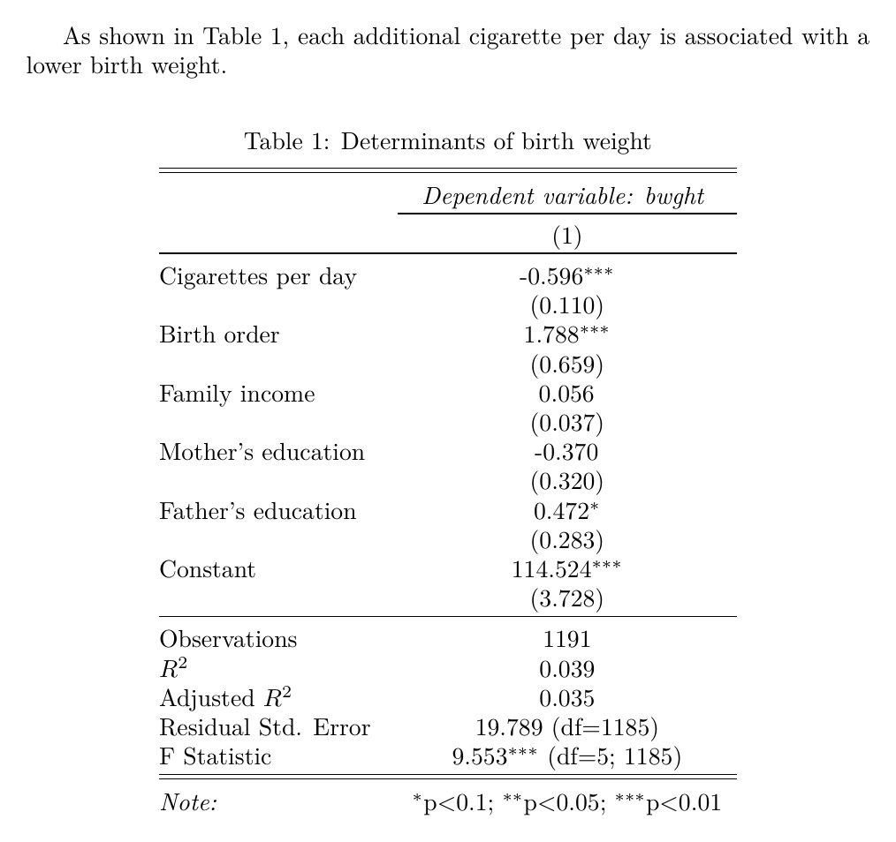
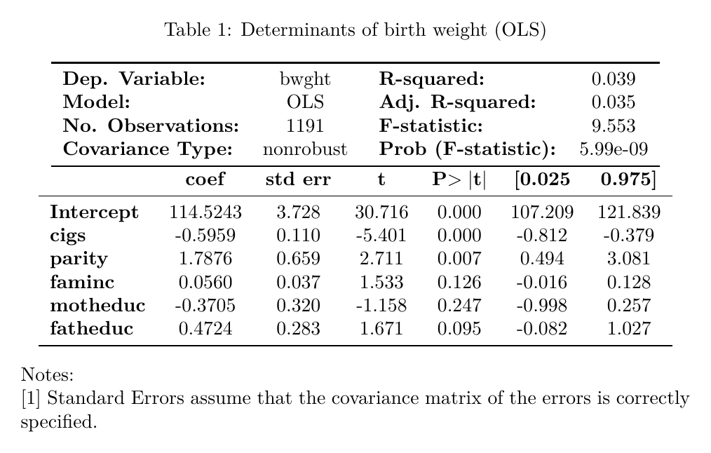

```{python}
#| echo: false
#| output: false
import sys
sys.path.insert(0, "../theme")
import bse_style
_ = bse_style.apply()

import numpy as np
import matplotlib.pyplot as plt
import seaborn as sns


def plot_densities(results, ax, true_beta=2):
    """Overlay the KDE of several Monte Carlo runs: results = {label: betas}."""
    colors = [bse_style.TEAL, bse_style.PURPLE, bse_style.ORANGE]
    for (label, betas), color in zip(results.items(), colors):
        sns.kdeplot(betas, fill=True, alpha=0.35, color=color, linewidth=2,
                    label=f"{label}   (sd = {betas.std():.3f})", ax=ax)
    ax.axvline(true_beta, color=bse_style.BLACK, ls="--", lw=1.3, label=r"True $\beta_2$")
    ax.set_xlabel(r"$\hat{\beta}_2$")
    ax.set_ylabel("Density")
    ax.legend(loc="upper right", fontsize=11)
```

## Overview {background-color="#0396A6"}

- Monte Carlo experiments: the sampling distribution of OLS
- How the DGP shapes that distribution
- A full regression output: estimates, standard errors, $t$-values, $p$-values
- Regression tables with `stargazer` and export to LaTeX

---

## Why These Topics?

::: {.callout-tip icon=false}
#### <svg width="16" height="16" viewBox="0 0 24 24" fill="none" stroke="currentColor" stroke-width="2"><rect x="3" y="3" width="18" height="18" rx="3"/><circle cx="8" cy="8" r="1.4"/><circle cx="16" cy="8" r="1.4"/><circle cx="12" cy="12" r="1.4"/><circle cx="8" cy="16" r="1.4"/><circle cx="16" cy="16" r="1.4"/></svg> Monte Carlo Experiments
- $\hat\beta$ is a **random variable**: a new sample gives a new estimate
- Simulation lets us *see* its distribution when we know the true DGP
:::

::: {.callout-tip icon=false}
#### <svg width="16" height="16" viewBox="0 0 24 24" fill="none" stroke="currentColor" stroke-width="2"><line x1="4" y1="21" x2="4" y2="14"/><line x1="4" y1="10" x2="4" y2="3"/><line x1="12" y1="21" x2="12" y2="12"/><line x1="12" y1="8" x2="12" y2="3"/><line x1="20" y1="21" x2="20" y2="16"/><line x1="20" y1="12" x2="20" y2="3"/><line x1="1" y1="14" x2="7" y2="14"/><line x1="9" y1="8" x2="15" y2="8"/><line x1="17" y1="16" x2="23" y2="16"/></svg> Changing the DGP
- Noise, sample size, collinearity: what makes an estimator **precise**?
:::

::: {.callout-tip icon=false}
#### <svg width="16" height="16" viewBox="0 0 24 24" fill="none" stroke="currentColor" stroke-width="2"><rect x="3" y="3" width="18" height="18" rx="2"/><line x1="3" y1="9" x2="21" y2="9"/><line x1="3" y1="15" x2="21" y2="15"/><line x1="9" y1="9" x2="9" y2="21"/></svg> Regression Output
- Every number in a regression table is a statistic of that sampling distribution
:::

---

## Monte Carlo Experiments {.section-divider-centered background-color="#0396A6"}

---

## An estimator is a random variable

In practice we observe **one** sample and compute **one** estimate:

<div class="eq-box-wrap"><div class="eq-box">

$$\hat{\beta} = (X'X)^{-1}X'y$$

</div></div>

But the sample is random: a **different sample** from the same population gives a **different** $\hat\beta$.

```{python}
#| echo: false
rng_ill = np.random.default_rng(7)
fig, axes = plt.subplots(1, 3, figsize=(11, 2.9), sharey=True)
colors = [bse_style.TEAL, bse_style.PURPLE, bse_style.ORANGE]
for j, (ax, color) in enumerate(zip(axes, colors)):
    x = rng_ill.uniform(0, 10, 30)
    y = 1 + 2 * x + rng_ill.normal(0, 4, 30)
    b2, b1 = np.polyfit(x, y, 1)
    ax.scatter(x, y, s=16, color=color, alpha=0.7)
    xs = np.array([0, 10])
    ax.plot(xs, b1 + b2 * xs, color=color, lw=2.2)
    ax.plot(xs, 1 + 2 * xs, color=bse_style.BLACK, lw=1, ls="--")
    ax.set_title(f"Sample {j + 1}:  " + r"$\hat\beta_2$" + f" = {b2:.2f}", fontsize=12)
    ax.set_xticks([]); ax.set_yticks([])
    ax.set_xlabel("x")
axes[0].set_ylabel("y")
fig.text(0.5, -0.03, r"Dashed line: true relation, slope $\beta_2 = 2$", ha="center", fontsize=11)
plt.tight_layout()
plt.show()
```

---

## The sampling distribution

The **sampling distribution** of $\hat\beta$ is its distribution across **all possible samples** of size $n$ drawn from the same DGP. It tells us two things:

- **Centre**: is $\hat\beta$ **unbiased**, $\;E(\hat\beta) = \beta$?
- **Spread**: how **precise** is it, $\;Var(\hat\beta)$?

<span style="color:#F28627; font-weight:600;">The problem:</span> we never *see* it. With real data we have a single sample, and the true $\beta$ is unknown.

::: {.callout-tip title="The Monte Carlo idea" icon=false}
Play the role of *nature*: **choose** the DGP (so we know the true $\beta$), draw many samples from it on the computer, and look at the estimates.
:::

---

## Seeing it: the sample mean

::: {#mc-widget .columns style="align-items:flex-start;"}

::: {.column width="36%"}
```{=html}
<div class="widget-controls">
  <div class="widget-step">1 · Population</div>
  <p>Choose a probability distribution: the population (DGP) we sample from.</p>
  <select id="mc-dist">
    <option value="uniform">Uniform</option>
    <option value="normal" selected>Normal</option>
    <option value="studentt">Student T</option>
    <option value="chisquare">Chi Squared</option>
    <option value="exponential">Exponential</option>
    <option value="centralF">Fisher–Snedecor</option>
  </select>
  <div class="widget-step">2 · One sample</div>
  <p>Choose a sample size \(n\) and sample once.</p>
  <div class="slider-row">
    <label for="mc-n">\(n\) = <span id="mc-n-value">10</span></label>
    <input id="mc-n" type="range" min="0" max="10" step="1" value="2"
           data-values="3,5,10,20,30,50,100,200,300,500,1000">
  </div>
  <div class="btn-row"><button class="widget-btn primary" id="mc-sample">Sample</button></div>
  <div class="widget-step">3 · Repeat the experiment</div>
  <p>Draw new samples from the population and average each one.</p>
  <!-- Bootstrap mode: hidden today, remove style="display:none" to show it (next session) -->
  <div class="mc-mode" style="display:none">
    <button class="widget-btn" data-mode="montecarlo">Monte Carlo</button>
    <button class="widget-btn" data-mode="bootstrap">Bootstrap</button>
  </div>
  <div class="btn-row">
    <button class="widget-btn" id="mc-resample">New sample</button>
    <button class="widget-btn" id="mc-resample-100">100 new samples</button>
  </div>
  <div class="widget-credit">Adapted from <a href="https://seeing-theory.brown.edu/frequentist-inference/index.html#section3" target="_blank">Seeing Theory</a> (D. Kunin et al., Brown University).</div>
</div>
```
:::

::: {.column width="64%"}
```{=html}
<div id="mc-svg" style="height:500px;"></div>
<div class="widget-stats" id="mc-stats">&nbsp;</div>
```
:::

:::

---

## What did we just do? {visibility="hidden"}

::: columns

::: {.column width="50%"}
::: {.callout-tip title="Monte Carlo" icon=false}
Each replication draws a **new sample from the population** (the balls fall from the *distribution* row).

- Possible only because **we chose the DGP**
- Approximates the *true* sampling distribution
- sd of $\bar x$ $\;\to\; \sigma/\sqrt{n}$
:::
:::

::: {.column width="50%"}
::: {.callout-note title="Bootstrap (Seeing Theory's version)" icon=false}
Each replication **resamples with replacement from the one sample** we observed (the balls fall from the *sample* row).

- Works with real data: the population is unknown
- The empirical distribution stands in for the population
:::
:::

:::

---

## What does the Monte Carlo experiment show?


**The steps we just followed**

```{=html}
<div class="mc-steps-list">
<div class="mc-step-row"><span class="mc-num">1</span><span>Fix a <b>population</b> we know (here: its mean \(\mu\))</span></div>
<div class="mc-step-row"><span class="mc-num">2</span><span>Draw a random <b>sample</b> of size \(n\)</span></div>
<div class="mc-step-row"><span class="mc-num">3</span><span>Compute the <b>statistic</b>: \(\bar x\)</span></div>
<div class="mc-step-row"><span class="mc-num">4</span><span><b>Repeat</b> steps 2–3 many times</span></div>
<div class="mc-step-row"><span class="mc-num">5</span><span>Plot the <b>histogram</b> of all the \(\bar x\)'s</span></div>
</div>
```

::: {.callout-note title="What we see" icon=false}
The histogram approximates the **sampling distribution** of $\bar x$:

- **Centre** at $\mu$: $\bar x$ is unbiased
- **Spread** shrinks with $n$: $sd(\bar x) = \sigma/\sqrt{n}$
- **Shape** close to normal for large $n$, even if the population is skewed (CLT)
:::


---

## Monte Carlo for an estimator

Same experiment, but the population is a regression DGP and, instead of $\bar{x}$, each sample gives us the OLS estimate $\hat{\beta_2}$

```{python}
#| echo: false
from matplotlib.patches import FancyArrowPatch

rng_ill = np.random.default_rng(3)
fig = plt.figure(figsize=(12.5, 3.3))

# (1) DGP box
ax0 = fig.add_axes([0.0, 0.1, 0.17, 0.8]); ax0.axis("off")
ax0.text(0.5, 0.62, "DGP", ha="center", fontsize=15, fontweight="bold", color=bse_style.PURPLE)
ax0.text(0.5, 0.40, r"$y = 4 + 2x_2 + 2x_3 + \varepsilon$", ha="center", fontsize=12)
ax0.text(0.5, 0.22, r"true $\beta_2 = 2$", ha="center", fontsize=11, color=bse_style.TEAL)
ax0.add_patch(plt.Rectangle((0.02, 0.08), 0.96, 0.75, fill=False, ec=bse_style.PURPLE, lw=1.5,
                            transform=ax0.transAxes))

# (2)-(3) three simulated samples with their estimate
lefts = [0.23, 0.38, 0.53]
for j, left in enumerate(lefts):
    ax = fig.add_axes([left, 0.2, 0.12, 0.62])
    x2 = rng_ill.uniform(0, 40, 60); x3 = x2 + rng_ill.normal(0, 16, 60)
    y = 4 + 2 * x2 + 2 * x3 + rng_ill.normal(0, 32, 60)
    X = np.column_stack([np.ones(60), x2, x3])
    b = np.linalg.solve(X.T @ X, X.T @ y)
    ax.scatter(x2, y, s=7, color=bse_style.TEAL, alpha=0.7)
    ax.set_xticks([]); ax.set_yticks([]); ax.grid(False)
    label = "sample R" if j == 2 else f"sample {j + 1}"
    ax.set_title(label, fontsize=11)
    ax.set_xlabel(r"$\hat\beta_2$" + f" = {b[1]:.2f}", fontsize=11, color=bse_style.ORANGE)
fig.text(0.515, 0.5, "···", ha="center", va="center", fontsize=18, color=bse_style.BLACK)

# (5) histogram of R estimates
ax4 = fig.add_axes([0.76, 0.2, 0.22, 0.62])
sims = rng_ill.normal(2, 0.35, 3000)
ax4.hist(sims, bins=35, density=True, color=bse_style.ORANGE, alpha=0.8, edgecolor="white")
ax4.axvline(2, color=bse_style.BLACK, ls="--", lw=1)
ax4.set_yticks([]); ax4.grid(False)
ax4.set_title(r"$R$ estimates of $\hat\beta_2$", fontsize=11)

for x0, x1 in [(0.175, 0.225), (0.665, 0.745)]:
    fig.patches.append(FancyArrowPatch((x0, 0.5), (x1, 0.5), transform=fig.transFigure,
                                       arrowstyle="-|>", mutation_scale=18, lw=2, color=bse_style.TEAL))
plt.show()
```

```{=html}
<div class="mc-steps">
<div class="mc-step"><span class="mc-num">1</span><div><b>Specify a DGP</b><br>parameters, regressors, errors</div></div>
<div class="mc-step"><span class="mc-num">2</span><div><b>Generate</b><br>one sample of size \(n\)</div></div>
<div class="mc-step"><span class="mc-num">3</span><div><b>Estimate</b><br>\(\hat\beta_2\) by OLS, store it</div></div>
<div class="mc-step"><span class="mc-num">4</span><div><b>Repeat</b><br>steps 2–3, \(R = 10{,}000\) times</div></div>
<div class="mc-step"><span class="mc-num">5</span><div><b>Summarise</b><br>histogram / KDE: centre, spread, shape</div></div>
</div>
```

---

## Data-Generating Process (DGP)

We generate $R = 10{,}000$ samples of size $n = 100$ from:

<div class="eq-box-wrap"><div class="eq-box">

$$
y_i = 4 + 2\,x_{i2} + 2\,x_{i3} + \varepsilon_i, \qquad \varepsilon_i \mid X \overset{iid}{\sim} N(0,\ \sigma_\varepsilon^2)
$$

$$
x_{i2} \sim U[0, 40], \qquad x_{i3} = x_{i2} + v_i, \quad v_i \sim N(0,\ \sigma_v^2)
$$

</div></div>

- Baseline values: $\;\sigma_\varepsilon = 32,\;\; \sigma_v = 16$
- True parameter of interest: $\beta_2 = 2$
- $x_{i3}$ is **correlated** with $x_{i2}$ through $v_i$

::: {.callout-warning title="Question" icon=false}
Under this DGP, is $\hat\beta_2$ unbiased? What should the histogram be centred at?
:::

---

## Monte Carlo in code

```{python}
#| echo: true
#| eval: true
#| code-line-numbers: "1-3|5-9|10-12|13"
def simulate_betas(n=100, sigma_eps=32, sigma_v=16, x2_max=40, reps=10_000, seed=42):
    rng = np.random.default_rng(seed)
    betas = np.empty(reps)
    for r in range(reps):
        # 2. generate one sample from the DGP
        x2 = rng.uniform(0, x2_max, n)
        x3 = x2 + rng.normal(0, sigma_v, n)
        eps = rng.normal(0, sigma_eps, n)
        y = 4 + 2 * x2 + 2 * x3 + eps
        # 3. estimate by OLS, (X'X)^{-1} X'y, and keep beta_2
        X = np.column_stack([np.ones(n), x2, x3])
        betas[r] = np.linalg.solve(X.T @ X, X.T @ y)[1]
    return betas
```

::: {.callout-note title="Note" icon=false}
`sm.OLS(y, X).fit()` gives the same $\hat\beta$, but solving $(X'X)\hat\beta = X'y$ directly is much faster inside a 10,000-iteration loop.
:::

---

## Summarising the 10,000 estimates

::: {.panel-tabset}

#### Code

```{python}
#| echo: true
#| eval: false
betas_base = simulate_betas()

fig, ax = plt.subplots(figsize=(9, 4.2))
sns.histplot(betas_base, bins=50, stat="density", color=bse_style.TEAL, alpha=0.5, ax=ax)
sns.kdeplot(betas_base, color=bse_style.PURPLE, linewidth=2.5, ax=ax)
ax.axvline(2, color="black", ls="--", label=r"True $\beta_2$")
plt.show()

print(f"mean = {betas_base.mean():.4f},  sd = {betas_base.std():.4f}")
```

#### Output

```{python}
#| echo: false
#| eval: true
betas_base = simulate_betas()

fig, ax = plt.subplots(figsize=(9, 4.2))
sns.histplot(betas_base, bins=50, stat="density", color=bse_style.TEAL, alpha=0.5,
             edgecolor="white", ax=ax, label="Density histogram")
sns.kdeplot(betas_base, color=bse_style.PURPLE, linewidth=2.5, ax=ax, label="KDE")
ax.axvline(2, color=bse_style.BLACK, ls="--", lw=1.3, label=r"True $\beta_2 = 2$")
ax.set_xlabel(r"$\hat{\beta}_2$")
ax.set_ylabel("Density")
ax.set_title(r"Sampling distribution of $\hat{\beta}_2$  ($R$ = 10,000, $n$ = 100)")
ax.legend(loc="upper right", fontsize=11)
plt.tight_layout()
plt.show()

print(f"mean = {betas_base.mean():.4f},  sd = {betas_base.std():.4f}")
```

:::

---

## Reading the histogram

::: columns

::: {.column width="50%"}
```{python}
#| echo: false
fig, ax = plt.subplots(figsize=(6, 3.3))
sns.histplot(betas_base, bins=50, stat="density", color=bse_style.TEAL, alpha=0.5,
             edgecolor="white", ax=ax)
m, s = betas_base.mean(), betas_base.std()
ax.axvline(2, color=bse_style.BLACK, ls="--", lw=1.3)
ax.annotate("", xy=(m + s, 0.55), xytext=(m - s, 0.55),
            arrowprops=dict(arrowstyle="<->", color=bse_style.ORANGE, lw=2))
ax.text(m, 0.62, r"$\pm$ 1 sd", ha="center", color=bse_style.ORANGE, fontweight="bold",
        bbox=dict(facecolor="white", edgecolor="none", pad=1.5))
ax.text(2.04, ax.get_ylim()[1] * 0.92, r"$\beta_2 = 2$", color=bse_style.BLACK)
ax.set_xlabel(r"$\hat{\beta}_2$")
ax.set_ylabel("Density")
plt.tight_layout()
plt.show()
```
:::

::: {.column width="50%"}
- **Centre**: the mean of the 10,000 estimates is ≈ 2, so $\hat\beta_2$ is **unbiased**
- **Spread**: the sd of the 10,000 estimates ≈ 0.35 tells us how much $\hat\beta_2$ moves from sample to sample
- **Shape**: bell-shaped, as expected with normal errors
:::

:::

::: {.callout-warning title="Exercise" icon=false}
What fraction of the 10,000 estimates lies within $\beta_2 \pm 1.96 \cdot sd$? Compute it with `np.mean(np.abs(betas_base - 2) < 1.96 * betas_base.std())`.

Why is it close to **95%**? This is the logic behind **confidence intervals** and **$t$-tests**: we will use it in the coming sessions.
:::

---

## Standard deviation vs. standard error

::: columns

::: {.column width="50%"}
::: {.callout-note title="Standard deviation of the estimator" icon=false}
$$sd(\hat\beta_2 \mid X) = \sqrt{\sigma^2_\varepsilon\,\big[(X'X)^{-1}\big]_{22}}$$

A **population** quantity: depends on the unknown $\sigma^2_\varepsilon$. With a Monte Carlo we can approximate it by the sd of the 10,000 estimates.
:::
:::

::: {.column width="50%"}
::: {.callout-tip title="Standard error" icon=false}
$$se(\hat\beta_2) = \sqrt{\hat\sigma^2\,\big[(X'X)^{-1}\big]_{22}}, \quad \hat\sigma^2 = \tfrac{SSE}{n-K}$$

An **estimate** of that sd, computed from **one sample**: it is what the regression output reports in the `std err` column.
:::
:::

:::

```{python}
#| echo: true
#| eval: true
import statsmodels.api as sm

rng = np.random.default_rng(1)                       # ONE sample from the same DGP
x2 = rng.uniform(0, 40, 100); x3 = x2 + rng.normal(0, 16, 100)
y = 4 + 2 * x2 + 2 * x3 + rng.normal(0, 32, 100)
one_sample = sm.OLS(y, sm.add_constant(np.column_stack([x2, x3]))).fit()

print(f"Monte Carlo sd of beta_2_hat (10,000 samples): {betas_base.std():.3f}")
print(f"Standard error from one sample:                {one_sample.bse[1]:.3f}")
```

---

## Changing the DGP {.section-divider-centered background-color="#0396A6"}

---

## What drives the spread of $\hat\beta_2$?

Under homoskedasticity, the variance of the OLS estimator (conditional on $X$) is

<div class="eq-box-wrap"><div class="eq-box">

$$
Var(\hat\beta_2 \mid X) = \sigma_\varepsilon^2\,\big[(X'X)^{-1}\big]_{22}
= \frac{\sigma_\varepsilon^2}{\displaystyle\sum_{i=1}^n (x_{i2}-\bar x_2)^2\,\big(1 - R_2^2\big)}
$$

</div></div>

where $R_2^2$ is the $R^2$ of regressing $x_2$ on the other regressors ($x_3$ and a constant).

| Element of the DGP | Effect on $\sum (x_{i2}-\bar x_2)^2 (1-R_2^2)$ | Distribution of $\hat\beta_2$ |
|---|---|---|
| ↑ noise $\sigma_\varepsilon$ | (numerator ↑) | more **dispersed** |
| ↑ sample size $n$ | ↑ more terms in the sum | more **concentrated** |
| ↑ spread of $x_2$ ($U[0, a]$, larger $a$) | ↑ | more **concentrated** |
| ↓ $\sigma_v$ (more **collinearity**) | $R_2^2 \uparrow$, so ↓ | more **dispersed** |

---

## 1. More noise: $\sigma_\varepsilon$

::: {.panel-tabset}

#### Code

```{python}
#| echo: true
#| eval: false
results = {
    r"$\sigma_\varepsilon = 16$": simulate_betas(sigma_eps=16),
    r"$\sigma_\varepsilon = 32$": betas_base,
    r"$\sigma_\varepsilon = 64$": simulate_betas(sigma_eps=64),
}
fig, ax = plt.subplots(figsize=(9, 4.2))
for label, betas in results.items():
    sns.kdeplot(betas, fill=True, alpha=0.35, label=label, ax=ax)
ax.axvline(2, color="black", ls="--")
plt.show()
```

#### Output

```{python}
#| echo: false
#| eval: true
results = {
    r"$\sigma_\varepsilon = 16$": simulate_betas(sigma_eps=16),
    r"$\sigma_\varepsilon = 32$": betas_base,
    r"$\sigma_\varepsilon = 64$": simulate_betas(sigma_eps=64),
}
fig, ax = plt.subplots(figsize=(9, 4.2))
plot_densities(results, ax)
ax.set_xlim(-1, 5)
plt.tight_layout()
plt.show()
```

:::

::: {.callout-warning title="Question" icon=false}
Doubling $\sigma_\varepsilon$: by how much does the sd of $\hat\beta_2$ change? Does the centre move?
:::

---

## 2. More data: $n$

::: {.panel-tabset}

#### Code

```{python}
#| echo: true
#| eval: false
results = {
    r"$n = 25$": simulate_betas(n=25),
    r"$n = 100$": betas_base,
    r"$n = 400$": simulate_betas(n=400),
}
fig, ax = plt.subplots(figsize=(9, 4.2))
for label, betas in results.items():
    sns.kdeplot(betas, fill=True, alpha=0.35, label=label, ax=ax)
ax.axvline(2, color="black", ls="--")
plt.show()
```

#### Output

```{python}
#| echo: false
#| eval: true
results = {
    r"$n = 25$": simulate_betas(n=25),
    r"$n = 100$": betas_base,
    r"$n = 400$": simulate_betas(n=400),
}
fig, ax = plt.subplots(figsize=(9, 4.2))
plot_densities(results, ax)
ax.set_xlim(-1, 5)
plt.tight_layout()
plt.show()
```

:::

::: {.callout-warning title="Question" icon=false}
Multiplying $n$ by 4 divides the sd of $\hat\beta_2$ by …? (Hint: $sd \propto 1/\sqrt{n}$.)
:::

---

## 3. More collinearity: $\sigma_v$

Recall $x_{i3} = x_{i2} + v_i$: a **smaller** $\sigma_v$ makes $x_3$ almost a copy of $x_2$.

::: {.panel-tabset}

#### Code

```{python}
#| echo: true
#| eval: false
results = {
    r"$\sigma_v = 32$ (low collinearity)": simulate_betas(sigma_v=32),
    r"$\sigma_v = 16$": betas_base,
    r"$\sigma_v = 4$ (high collinearity)": simulate_betas(sigma_v=4),
}
fig, ax = plt.subplots(figsize=(9, 3.8))
for label, betas in results.items():
    sns.kdeplot(betas, fill=True, alpha=0.35, label=label, ax=ax)
ax.axvline(2, color="black", ls="--")
plt.show()
```

#### Output

```{python}
#| echo: false
#| eval: true
results = {
    r"$\sigma_v = 32$ (low collinearity)": simulate_betas(sigma_v=32),
    r"$\sigma_v = 16$": betas_base,
    r"$\sigma_v = 4$ (high collinearity)": simulate_betas(sigma_v=4),
}
fig, ax = plt.subplots(figsize=(9, 3.8))
plot_densities(results, ax)
ax.set_xlim(-1, 5)
plt.tight_layout()
plt.show()
```

:::

::: {.callout-note title="Note" icon=false}
Collinearity does **not** bias $\hat\beta_2$: it only makes it imprecise, since there is little independent variation in $x_2$ left to learn from.
:::

---

## Your turn: play with the DGP

::: {#dgp-widget .columns style="align-items:flex-start;"}

::: {.column width="36%"}
```{=html}
<div class="widget-controls">
  <p>\(y_i = 4 + 2x_{i2} + 2x_{i3} + \varepsilon_i\), &nbsp; \(x_{i2}\sim U[0,a]\), &nbsp; \(x_{i3}=x_{i2}+v_i\)</p>
  <p>Each change re-runs <b>2,000</b> Monte Carlo replications.</p>
  <div class="slider-row">
    <label for="dgp-n">\(n\) = <span id="dgp-n-value">100</span></label>
    <input id="dgp-n" type="range" min="10" max="500" step="10" value="100">
  </div>
  <div class="slider-row">
    <label for="dgp-seps">\(\sigma_\varepsilon\) = <span id="dgp-seps-value">32</span></label>
    <input id="dgp-seps" type="range" min="2" max="80" step="2" value="32">
  </div>
  <div class="slider-row">
    <label for="dgp-sv">\(\sigma_v\) = <span id="dgp-sv-value">16</span></label>
    <input id="dgp-sv" type="range" min="1" max="50" step="1" value="16">
  </div>
  <div class="slider-row">
    <label for="dgp-a">\(a\) = <span id="dgp-a-value">40</span></label>
    <input id="dgp-a" type="range" min="5" max="100" step="5" value="40">
  </div>
  <div class="btn-row">
    <button class="widget-btn secondary" id="dgp-keep">Keep as reference</button>
    <button class="widget-btn" id="dgp-rerun">Re-run</button>
    <button class="widget-btn" id="dgp-reset">Reset</button>
  </div>
  <p style="font-size:0.85em;">Click <b>Keep as reference</b>, then move one slider: the <span style="color:#F28627;font-weight:600;">orange outline</span> keeps the old distribution.</p>
</div>
```
:::

::: {.column width="64%"}
```{=html}
<div id="dgp-svg" style="height:430px;"></div>
<div class="widget-stats" id="dgp-stats">&nbsp;</div>
```
:::

:::

---

## Summary: concentrate or disperse?


| Change in the DGP | Centre | Spread |
|---|---|---|
| $\sigma_\varepsilon$ ↑ | $\beta_2$ | ↑ dispersed |
| $n$ ↑ | $\beta_2$ | ↓ concentrated |
| range of $x_2$ ↑ | $\beta_2$ | ↓ concentrated |
| $\sigma_v$ ↓ (collinearity ↑) | $\beta_2$ | ↑ dispersed |

::: {.callout-tip title="Take-away" icon=false}
None of these changes moves the **centre**: as long as $E(\varepsilon \mid X) = 0$, OLS is unbiased.

They only change the **precision**, which is exactly what the *standard error* measures in a regression output.
:::


---

## A full regression output {.section-divider-centered background-color="#0396A6"}

---

## Wooldridge datasets

The textbook by **Wooldridge** comes with **100+ real datasets**: wages, education, crime, housing, health, macro time series…
All of them are available in Python through the `wooldridge` package (`description=True` prints the variables and the source):

<div class="browser-mockup"><div class="browser-mockup-bar"><span class="dot dot-red"></span><span class="dot dot-yellow"></span><span class="dot dot-green"></span><span class="browser-mockup-url">fmwww.bc.edu/ec-p/data/wooldridge/datasets.list.html</span></div><div class="browser-mockup-body"><a href="http://fmwww.bc.edu/ec-p/data/wooldridge/datasets.list.html" target="_blank"></a></div></div>


---

## Birthweight Data

The `bwght` dataset (Wooldridge) contains information on births in the United States, used to study the determinants of birth weight, in particular maternal smoking during pregnancy.

```{python}
#| echo: true
#| eval: true
import wooldridge as woo

df = woo.dataWoo("bwght").dropna()
df[["bwght", "cigs", "parity", "faminc", "motheduc", "fatheduc"]].head(5)
```

---

## The model

$$\texttt{bwght}_i = \beta_1 + \beta_2 \texttt{cigs}_i + \beta_3 \texttt{parity}_i + \beta_4 \texttt{faminc}_i + \beta_5 \texttt{motheduc}_i + \beta_6 \texttt{fatheduc}_i + \varepsilon_i$$

where:

- $\texttt{bwght}$: birth weight, in **ounces**
- $\texttt{cigs}$: cigarettes smoked per day by the mother while pregnant
- $\texttt{parity}$: birth order of the child
- $\texttt{faminc}$: annual family income, in \$1000s
- $\texttt{motheduc}$, $\texttt{fatheduc}$: years of schooling of the mother and the father

---

## Regression output in Python

```{python}
#| echo: true
#| eval: true
import statsmodels.formula.api as smf

model = smf.ols("bwght ~ cigs + parity + faminc + motheduc + fatheduc", data=df).fit()
print(model.summary(slim=True))
```

---

## Anatomy of a regression table

For each coefficient $k$ the output reports:

| Column | Formula | Meaning |
|---|---|---|
| `coef` | $\hat\beta_k = \big[(X'X)^{-1}X'y\big]_k$ | point estimate |
| `std err` | $se(\hat\beta_k) = \sqrt{\hat\sigma^2\,\big[(X'X)^{-1}\big]_{kk}}$, $\;\hat\sigma^2 = \frac{\hat\varepsilon'\hat\varepsilon}{n-K}$ | estimated sd of the sampling distribution |
| `t` | $t_k = \dfrac{\hat\beta_k - 0}{se(\hat\beta_k)}$ | test of $H_0: \beta_k = 0$ |
| `P>|t|` | $2\,P\big(t_{n-K} > |t_k|\big)$ | two-sided $p$-value |
| `[0.025, 0.975]` | $\hat\beta_k \pm t_{n-K,\,0.975}\; se(\hat\beta_k)$ | 95% confidence interval |

::: {.callout-tip title="Link with the Monte Carlo" icon=false}
The `std err` column is our best estimate, from **one** sample, of the spread we just saw across 10,000 simulated samples.
:::

---

## Computing it by hand: `cigs`

```{python}
#| echo: true
#| eval: true
#| code-line-numbers: "1-5|7-9|11-13|15-17"
from scipy import stats

X = model.model.exog                # design matrix (with constant)
n, K = X.shape
XtX_inv = np.linalg.inv(X.T @ X)

sigma2_hat = model.ssr / (n - K)     # SSE / (n - K)
se = np.sqrt(sigma2_hat * np.diag(XtX_inv))
k = 1                                # position of cigs

t_stat = model.params.iloc[k] / se[k]
p_value = 2 * (1 - stats.t.cdf(abs(t_stat), df=n - K))
t_crit = stats.t.ppf(0.975, df=n - K)

print(f"beta = {model.params.iloc[k]:.4f}   se = {se[k]:.4f}   t = {t_stat:.3f}   p = {p_value:.2e}")
print(f"95% CI = [{model.params.iloc[k] - t_crit * se[k]:.4f}, {model.params.iloc[k] + t_crit * se[k]:.4f}]")
print(f"statsmodels: se = {model.bse.iloc[k]:.4f}   t = {model.tvalues.iloc[k]:.3f}   p = {model.pvalues.iloc[k]:.2e}")
```

---

## Regression tables with `stargazer` {.section-divider-centered background-color="#0396A6"}

---

## Why `stargazer`?


`model.summary()` is great for **reading** results, but it is not what goes in a paper or an assignment.

::: {.callout-tip title="stargazer" icon=false}
Builds a **publication-style** regression table from one or several fitted `statsmodels` models:

- coefficients with **significance stars**
- **standard errors** (or confidence intervals) in parentheses
- $N$, $R^2$, adjusted $R^2$, $\hat\sigma$, $F$
- rendered as **HTML** (notebook / slides) or **LaTeX** (assignment)
:::


---

## Exporting to LaTeX: `render_latex()`

::: columns

::: {.column width="52%"}
```{python}
#| echo: true
#| eval: true
#| code-line-numbers: "1|3|4-5|6-15|17|19-20"
from stargazer.stargazer import Stargazer

sg = Stargazer([model])
sg.title("Determinants of birth weight")
sg.table_label = "tab:bwght"      # for \ref{}
sg.rename_covariates({
    "cigs": "Cigarettes per day",
    "parity": "Birth order",
    "faminc": "Family income",
    "motheduc": "Mother's education",
    "fatheduc": "Father's education",
    "Intercept": "Constant",
})
sg.covariate_order(["cigs", "parity", "faminc",
                    "motheduc", "fatheduc", "Intercept"])

latex = sg.render_latex()         # LaTeX code (a string)

with open("regression_output.tex", "w") as f:
    f.write(latex)
```

<p style="font-size:0.6em;">Options: <code>sg.show_confidence_intervals(True)</code> (CIs instead of SEs), <code>sg.significant_digits(2)</code>, <code>render_latex(only_tabular=True)</code>.</p>
:::

::: {.column width="48%"}
`regression_output.tex` (first lines):

```{python}
#| echo: false
#| eval: true
print("\n".join(latex.splitlines()[:16]) + "\n...")
```
:::

:::

---

## Using the table in your assignment

::: {.columns style="align-items:flex-start;"}

::: {.column width="45%"}
Put `regression_output.tex` next to your `main.tex` (in Overleaf: **Upload**), then:

```{.tex}
\documentclass{article}
\begin{document}

As shown in Table~\ref{tab:bwght},
each additional cigarette per day
is associated with a lower birth weight.

\input{regression_output.tex}

\end{document}
```


:::

::: {.column width="55%"}

:::

:::

---

## The full output in LaTeX: $t$, $p$-values and CIs

::: {.columns style="align-items:flex-start;"}

::: {.column width="45%"}
`statsmodels` can export the **whole** `summary()` to LaTeX:

```{python}
#| echo: true
#| eval: true
latex_full = model.summary(slim=True).as_latex()

with open("regression_full.tex", "w") as f:
    f.write(latex_full)
```

In `main.tex` (it needs `booktabs`):

```{.tex}
\usepackage{booktabs}   % in the preamble
...
\begin{table}[!htbp]
  \caption{Determinants of birth weight (OLS)}
  \label{tab:full}
  \input{regression_full.tex}
\end{table}
```
:::

::: {.column width="55%"}


:::

:::

---

## Preview: is `cigs` significant?

::: {.callout-warning title="Exercise" icon=false}
Using the output above, test whether $\texttt{cigs}$ is statistically significant at $\alpha = 5\%$.

1. State the **null and alternative hypotheses**.
2. Write the **$t$-statistic** and its distribution under $H_0$.
3. State the **decision rule** and draw the acceptance and rejection regions (label the axes, include the critical values).
4. Draw the **$p$-value**. What is the minimum significance level at which $\texttt{cigs}$ is significant?
:::

# Thanks! {background-color="#0396A6"}
